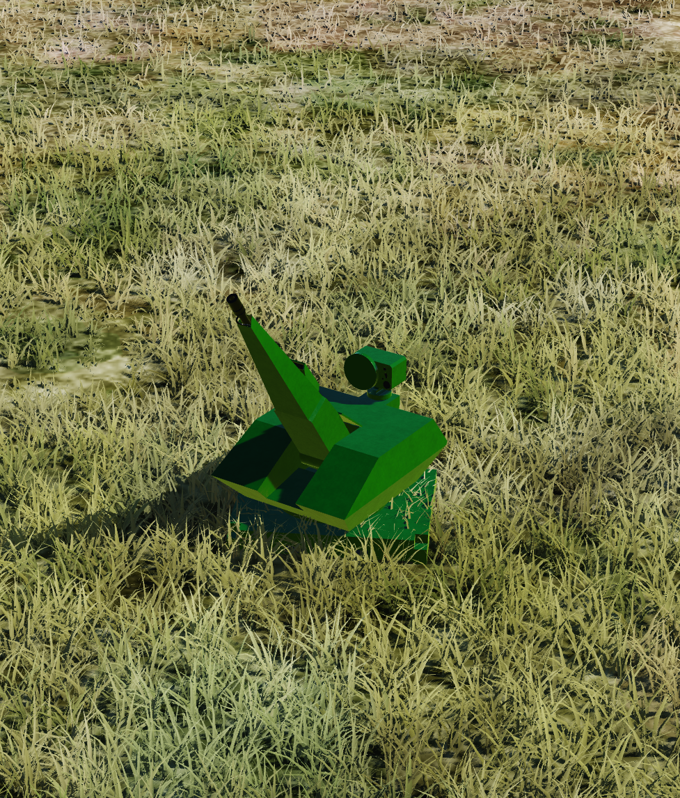
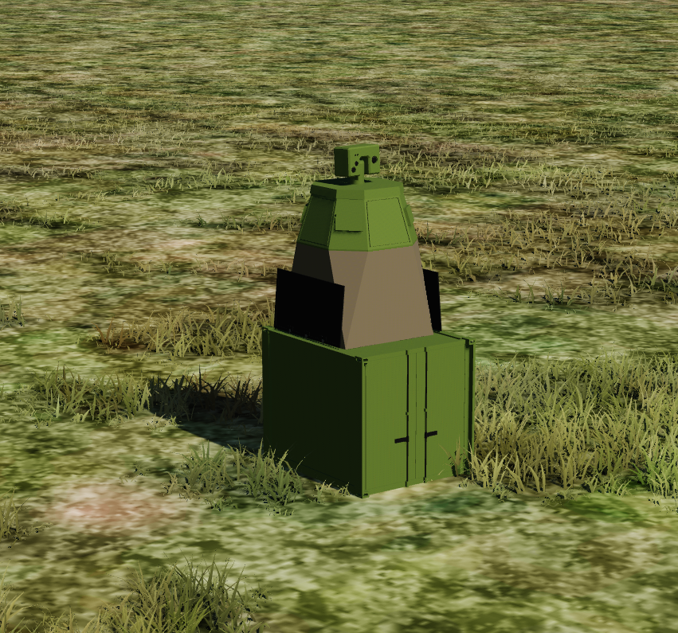
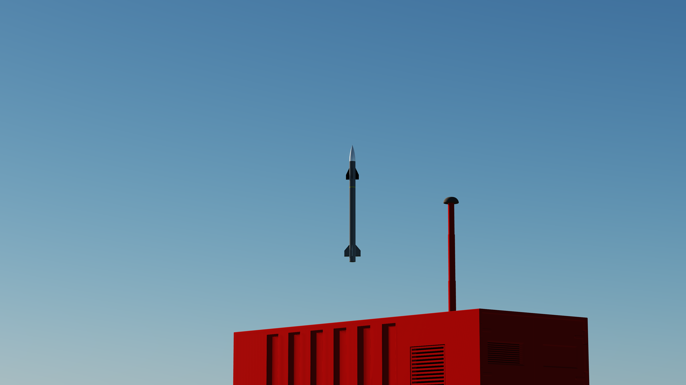
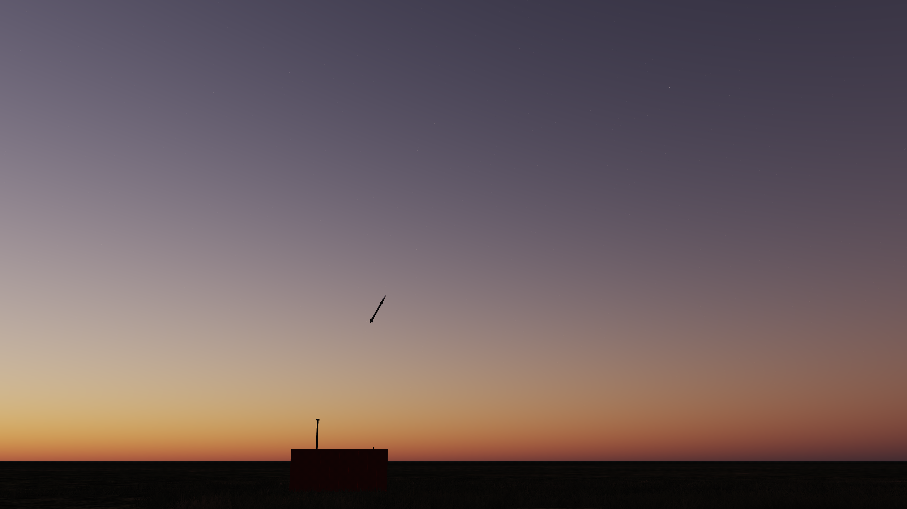
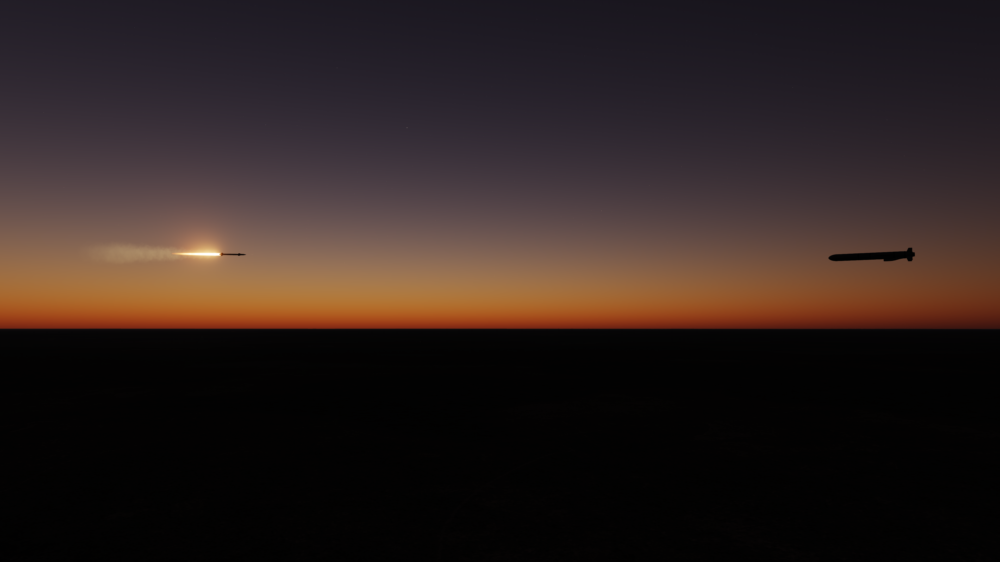
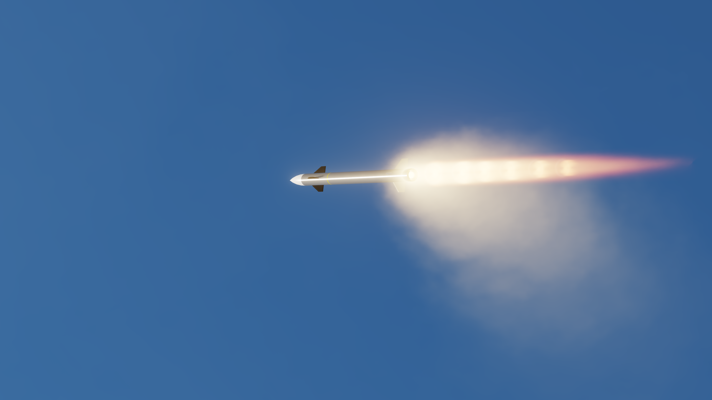

SkyKnight MLU:
Launcher for SkyKnight missiles, houses 60 missiles, "cold launched", needs Oerlikon MSU to work (I have yet to model the Command and Control module so its just the radar)

SkyKnight Missile:
Small, very light missile with short range, up to 10km for aircraft, 6-8km for cruise missiles and Shaheds or the likes, less for rockets. Cannot hit artillery or mortar shells because idk, DCS didnt like that

Oerlikon MSU:
Radar with ~35km range, animated FLIR but its not operational, can detect missiles, rockets, aircraft and other PGMs

Oerlikon RevolverGun Mk3:
Short range C-RAM gun with 35mm caliber, supposed to have its own sensors but that only made problems so it needs the Oerlikon MSU as well; AHEAD shell (timer fuzed fragmentation) modeled as basically a giant shotgun, up to 4km with obviously less range against faster things like rockets

I make whatever I want to make which is mostly stuff that I can find enough details on (specifically dimensions for 3d modeling). I'm not good at texturing and especially bad at shading so excuse the visual quality.
The performance may not be entirely accurate to IRL but thats often due to limitations with the DCS engine and ofc a lack of details.

Use at your own discretion

If you want to contribute or something along those lines, DM me on Discord: @zahnatom

